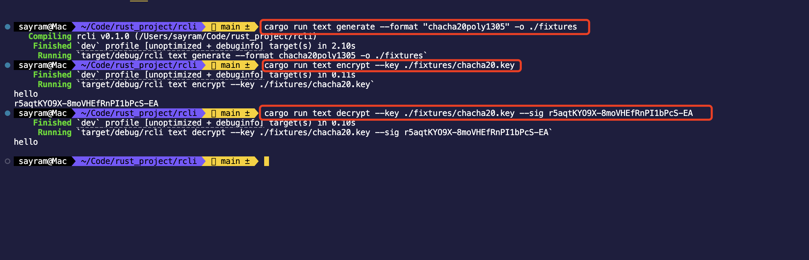
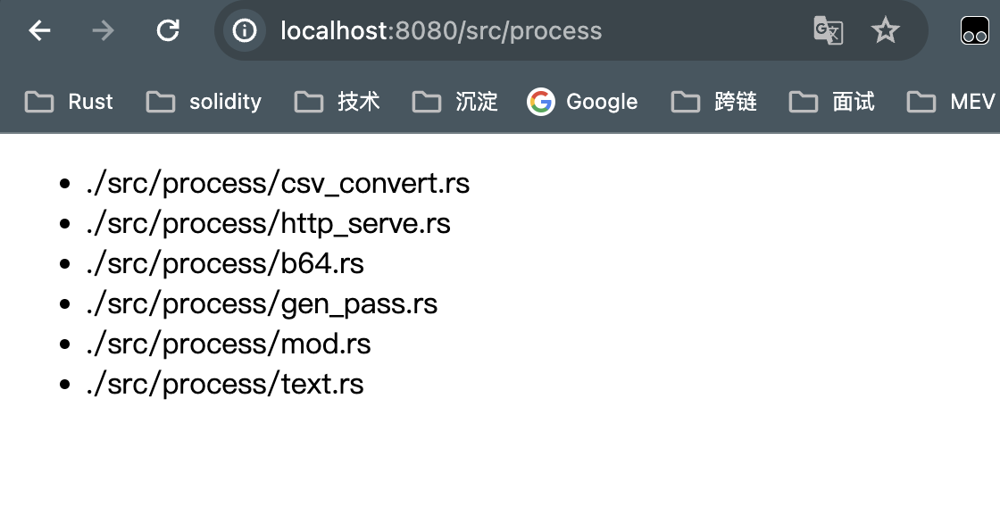

# rcli
## 作业1
阅读 chacha20poly1305 文档，了解其使用方法并构建 CLI 对输入文本进行加密 / 解密  

代码  

https://github.com/Rustzzz/rcli/commit/fe2776ea8049dd9ab7c11b8872a20ace4c36aeec

## 作业2
构建一个 CLI 来为给定 sub/aud/exp/… 生成一个 jwt。要求生成的 jwt 可以通过 jwt.io 的验证  

## 作业3
HTTP 文件服务器添加对 directory index 的支持  

代码  

https://github.com/Rustzzz/rcli/commit/5672e5da4abb59595e7359f4c532a6a019ffa5f8

#